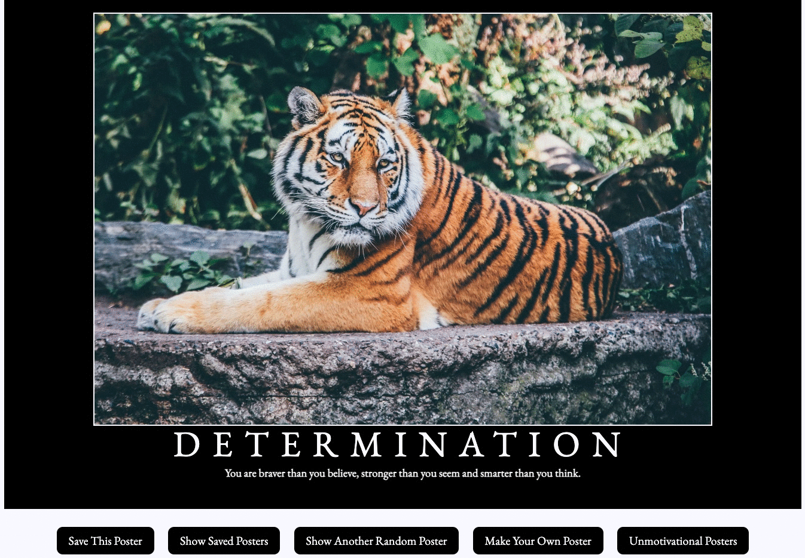

# Hang in There  

### Abstract:
This is a motivational posters application to help brighten your day when you need a pick me up.  When you go the website it will display a randomly generated motivational poster.  If you like the poster, you have the ability to save that poster to your saved posters section so you can go back to it later.  You also have the ability to generate other random posters and even fill out a form with your own custom image, poster title, and motivational quote to create your own motivation posters which you can then save.  It will also automatically save your provided image, title, and quote so it can use those to generate other random motivational posters for you.  For fun, we also added an unmotivational posters section to show unmotivational posters.  Sometimes these can cause you to smile, or even laugh, if you're having a bad day at the abusrity of it all.  If there is one, or more, that you really don't like then you can double click on them and it will delete that unmotivational poster for you.

### Installation Instructions:
If you just want to use this app on your computer you can clone it down to your computer, cd into the repository (the directory where you cloned it.) By default this will be hang-in-there unless you specify a different directory name.  From there on a MAC: open index.html to run it.  On a PC: right-click on index.html and choose the brower of your choice to open the file.  If you wish to modify the code then you can fork the repository to your personal github and then clone down your forked repository to customize the application.

### Preview of App:

### Context:
We were assigned this project on our first day of Mod2 in Turing, which is when we first start learning frontend coding (HTML/CSS/JavaScript).  I didn't keep an exact count of the time I spent working on this project, but based on when I finished it I estimate it was approximately 15 hours of total time to get the full project completed.

### Contributors:
My GitHub: https://github.com/Rockrat2008  
My LinkedIn: https://www.linkedin.com/in/michaelobrien67/

### Learning Goals:
The primary learning goal of this project was JavaScript skills, along with modifying/adding some HTML to work with the JavaScript and then CSS using flexbox for some of the layout.  
The technologies used were HTML, CSS, and JavaScript for the entirity of the project.  The browser developer tools, along with console.log statements and JavaScripter debugger were used for troubleshooting.

### Wins + Challenges:
My biggest win for this project was completing it in its entirity and seeing it function as requested.  My second biggest win, which led to my first biggest win is the ability to delete the unmotivational posters by double-clicking on them.  This was my biggest challenge.  First was figuring out the logic to identify if the user was clicking on part of one of the posters, and which part that was and then deleting it.  The second issue tied into both the unmotivational posters section and the saved posters section.  This was that when the page was built in JavaScript (posters added) if you went back to the main page and then back into that section the original posters showed up from the first visit and each additional visit caused the posters to populate again when it rendered the page.  I had to come up with logic that tore down the page when you back to the main page and then created it fresh using the saved posters, including any additional posters the user may have saved, and only displaying the unmotivational posters, minus any that had been deleted.
